# 《计算机图形学》系统使用说明书

**欧阳鸿荣 161220096**

（南京大学 计算机科学与技术系 南京 210093）

【摘要】：本绘图系统模拟了Windows下的绘图工具，实现了直线、曲线、圆、椭圆和多边形的输入，编辑和平移、旋转缩放等变换功能，同时实现了直线的裁剪、任意区域的填充以及二维图形的存储功能，能够将绘制出来的图形保存为图像。并且支持三维模型的显示，能够载入并显示一个OFF格式的三维模型。2D图像的操作主要通过鼠标，3D图像的操作主要通过键盘，交互方便，界面清新简洁。

[TOC]

## 1.综述
### 1.1 基本功能：

1. ##### 二维图形的输入功能：

   - 直线、曲线、圆、椭圆、多边形的输入实现
     - 类画图软件，用鼠标交互
     - 直线实现了**Bresenham和DDA算法**
     - 曲线实现了**贝塞尔曲线**
     - 圆实现了**Bresenham和中点圆算法**
     - 椭圆实现了**中点椭圆算法**
   - 填充区域的输入
     - 实现了类似油漆桶的功能，使用的是**洪泛填充算法**
     - **鼠标点击区域**，洪泛填充与区域颜色相同的区域

2. ##### 二维图形的编辑功能：

   - 直线、曲线、圆，椭圆，多边形的编辑
     - 直线能编辑起点、终点
     - 曲线能编辑贝赛尔曲线的各个控制点
     - 圆能编辑半径
     - 椭圆能编辑长轴a和短轴b的长度
     - 多边形能编辑任意顶点
     - **鼠标点击拖动交互编辑**，更加自由

3. ##### 二维图形的裁剪功能

   - 实现直线的裁剪
     - 使用**梁友栋算法**对直线进行裁剪
   - 裁剪窗口可用鼠标点击拖动输入
   - **裁剪后的图形仍然可以编辑**

4. ##### 二维图形的变换功能

   - 直线、曲线、圆、椭圆、多边形的平移
   - 直线、曲线、圆、椭圆、多边形的旋转
     - **任意角度旋转**
     - 直线、圆的旋转实现了**精度控制**
       - 旋转次数不多的情况下，长度/半径误差在1以内
   - 直线、曲线、圆、椭圆、多边形的缩放
   - **对变换后的图形仍然可以编辑**

5. ##### 二维图形的存储功能

   - 可以将绘制出来的图形保存为图像

6. ##### 三维模型的显示功能

   - 可以载入并显示一个OFF格式的三维模型
   - 载入后可以通过键盘**控制观察的视角和三维模型的旋转**

### 1.2 扩展功能：

1. 画布的创建，多画布切换
2. 颜色的选择
3. 增加了画笔和笔刷的功能
4. 清屏和撤销的功能
5. 打开图片编辑的功能

### 1.3 演示

- 将项目打包成了一个.exe文件，放在本报告的该目录下供助教测试。
- 关于直线、圆等动态演示，可以通过该目录下的markdown或者html文件进行阅读，也可以在我的github个人主页查看 https://tsunaou.github.io/GraphicsYoung.html

    

## 

## 2.开发环境与编译说明
| 系统名     | 语言和框架     | IDE        | 编译器      |
| ---------- | -------------- | ---------- | ----------- |
| PaintYoung | C++和Qt 5.11.2 | Qt Creator | MinGW 5.3.0 |

本绘图系统名为YoungPaint，基于C++和Qt 5.11.2，于Qt Creator上开发，编译环境为MinGW 5.3.0。

编译开发的构建配置如下图：

    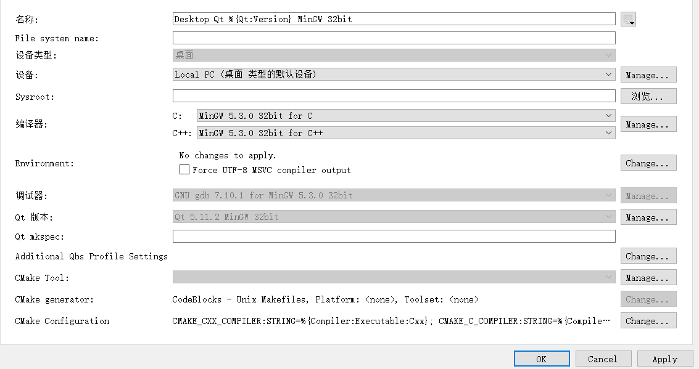
    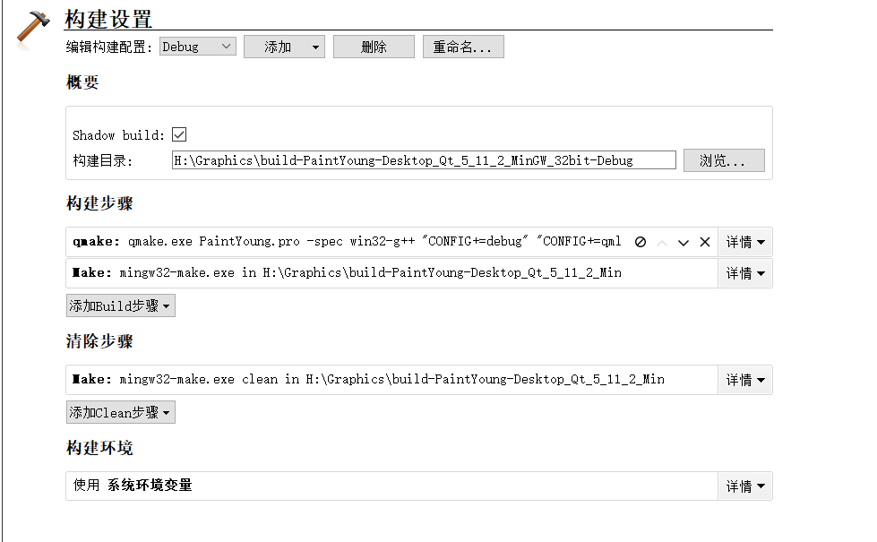

## 

## 3.程序运行说明

程序通过deployqt工具打包，并且通过Enigma Virtual Box工具集成在了161220096_可执行文件.exe文件中，可以直接点击运行使用。使用时如果有未响应事件，再次点击运行即可。

## 4.程序使用说明

为了更好地展现使用效果，我采用GIF图的形式。但是PDF不能显示GIF，因此还麻烦助教能够打开我提供的markdown版本或者html版本查看更为详细的使用说明。如有不便，十分抱歉。

#### 4.1 打开画面：

    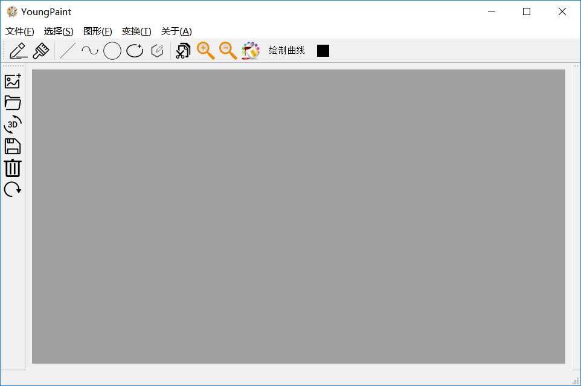

#### 4.2 创建新画布：

- 点击左侧工具栏的创建新画布，则可以创建画布，并且可以创建多个画布

    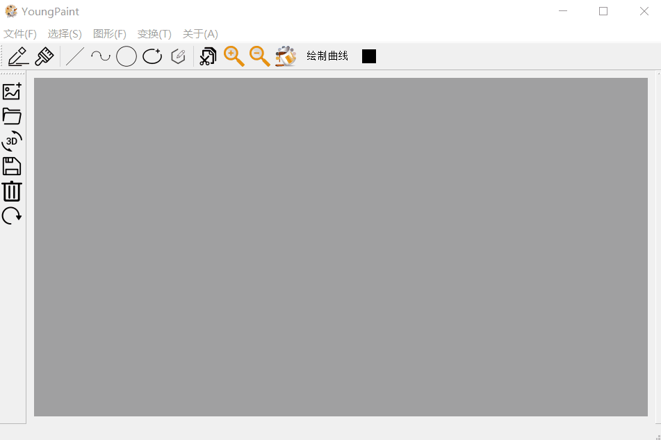

#### 4.3 直线的输入和编辑：

##### **4.3.1.直线的输入：**

- 点击上方工具栏的直线，则可绘制直线，鼠标点击确定起点，释放确定终点。

    

##### **4.3.2 直线的编辑：**

- 直线有4个可以操纵的点：起始点，终点，中点，四等分点。
- 用鼠标拖动起点和终点可以改变起始点

    

##### **4.3.3 直线的变换：**

- 拖动中点可以对直线平移，拖动四等分点可以对直线进行旋转。
- 点击工具栏放大/缩小即可对直线进行放缩，也可以用ctrl + + 和ctrl + -快捷键。

    

**4.3.4 直线的裁剪：**

- 在直线输入/编辑状态时，点击工具栏“裁剪”图标即可绘制裁剪框，再次点击“裁剪”图标即可对直线裁剪。
- 裁剪后直线可以再次编辑

    

#### 4.4 曲线的输入和编辑

##### **4.4.1 曲线的输入：**

- 点击上方工具栏的曲线，则可绘制曲线。曲线的绘制分为两个步骤
  - 首先，点击曲线图标后，鼠标点击确定控制点
  - 当确定好所有控制点后，点击工具栏的绘制曲线按钮，则可以进行曲线绘制
- 曲线的绘制过程中，若控制点数目较少时，会显示会绘制点的动画。

    

##### **4.4.2 曲线的编辑：**

- 对于绘制完毕的曲线，可以用鼠标点击并拖动各个控制点。由于贝塞尔曲线的性质，牵一发而动全身。一个控制点的改变会引起整条曲线形状的变化。

    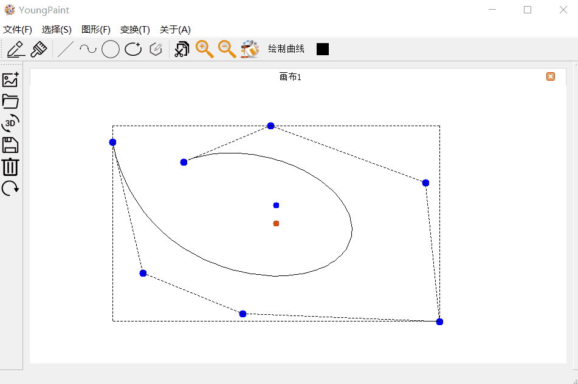

##### **4.4.3 曲线的变换：**

- 拖动曲线的中心点可以对曲线平移
- 拖动曲线的旋转点可以对旋转点进行旋转。
- 点击工具栏放大/缩小即可对直线进行放缩，也可以用ctrl + + 和ctrl + -快捷键。
- 旋转后的曲线依然可以继续编辑

    

#### 4.5 圆的输入和编辑：

##### **4.5.1 圆的输入：**

- 点击上方工具栏的圆，则可绘制圆。鼠标点击确定圆心，释放确定半径

##### **4.5.2 圆的编辑：**

- 圆有3个可以操纵的点：圆心，半径点，二分之半径点。
- 用鼠标拖动半径点可以改变圆大小

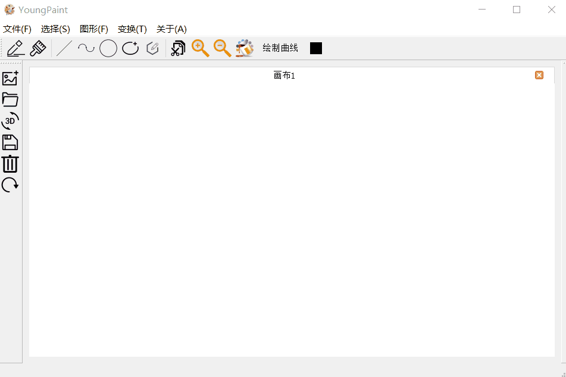

##### **4.5.3 圆的变换：**

- 拖动圆心可以对圆平移
- 拖动二分之半径点可以对圆进行旋转（虽然旋转没什么必要）。
- 点击工具栏放大/缩小即可对直线进行放缩，也可以用ctrl + + 和ctrl + -快捷键
- 旋转后的圆依然可以继续编辑

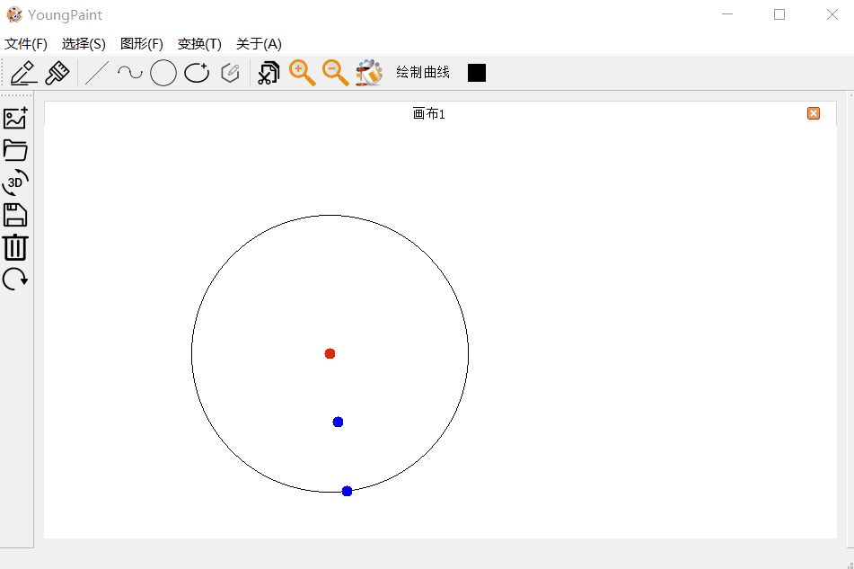

#### 4.6 椭圆的输入和编辑：

##### **4.6.1 椭圆的输入：**

- 点击上方工具栏的椭圆，则可绘制椭圆。鼠标点击确定中心，释放确定长轴和短轴

	

##### **4.6.2 椭圆的编辑：**

- 椭圆有3个可以操纵的点：中心，外接矩形顶点，旋转点。
- 用鼠标拖动外接矩形顶点可以改变椭圆形状

	

##### **4.6.3 椭圆的变换：**

- 拖动中心可以对椭圆平移
- 拖动旋转点可以对椭圆进行旋转（不过由于精度损失，旋转的椭圆轮廓会变粗）。
- 点击工具栏放大/缩小即可对直线进行放缩，也可以用ctrl + + 和ctrl + -快捷键
- 旋转后的椭圆依然可以继续编辑

	

#### 4.7 多边形的输入和编辑：

##### **4.7.1 多边形的输入：**

- 点击上方工具栏多边形，则可绘制多边形。鼠标点击确定各个顶点，点击右键或靠近起始点会自动贴合。

	

##### **4.7.2 多边形的编辑：**

- 多边形的外界矩形中心，各个顶点，旋转点可编辑。
- 用鼠标拖动各个顶点可以改变多边形形状

	

##### **4.7.3 多边形的变换：**

- 拖动外界矩形中心可以对多边形平移
- 拖动旋转点可以对多边形进行旋转。
- 点击工具栏放大/缩小即可对多边形进行放缩，也可以用ctrl + + 和ctrl + -快捷键
- 旋转后的多边形依然可以继续编辑

	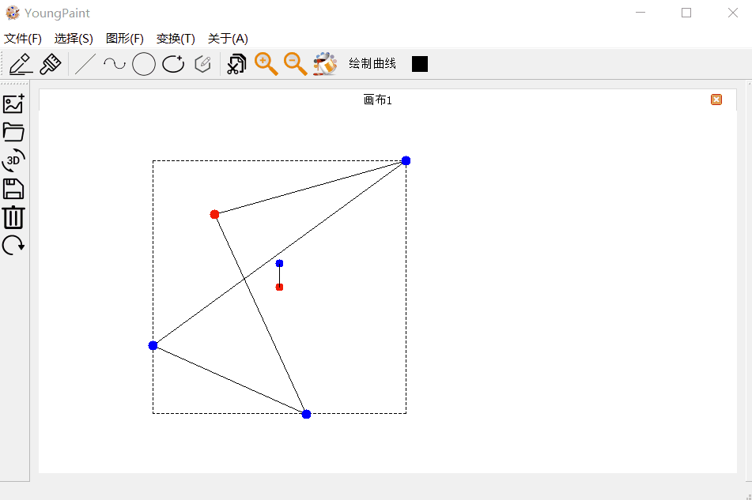

#### 4.8 填充:

- 点击工具栏的“油漆桶”即可使用填充功能。会对4-连通区域的同颜色点填充

    

#### 4.9 保存：

- 点击左侧工具栏保存按钮，即可保存

    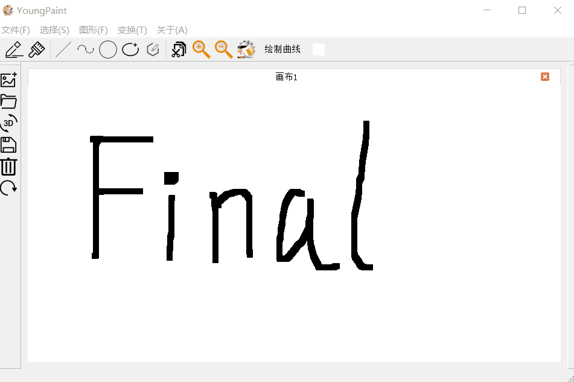

#### 4.10 3D图形的显示：

##### 4.10.1 打开OFF文件

- 点击左侧工具栏的创建新3D画布，则可以创建3D画布
- 创建画布时，可以通过文件选择器打开OFF格式的文件进行显示

##### 4.10.2 调整查看3D模型方式

- 打开OFF文件后，由于读取时对坐标做了标准化，因此图形会在视窗中央
- 此时可以通过方向键和小键盘的1235键（可看做另一个方向键）进行视角和旋转
  - 方向键左右键可以对3D图形进行旋转
  - 方向键上下键可以对3D图形进行前后平移（改变观察的Z坐标）
  - 小键盘1和3键可以对3D图形进行左右平移（改变观察的X坐标）
  - 小键盘2和5键可以对3D图形进行上下平移（改变观察的Y坐标）

    

#### 4.11 撤销：

- 点击左侧工具栏撤销按钮，即可撤销

    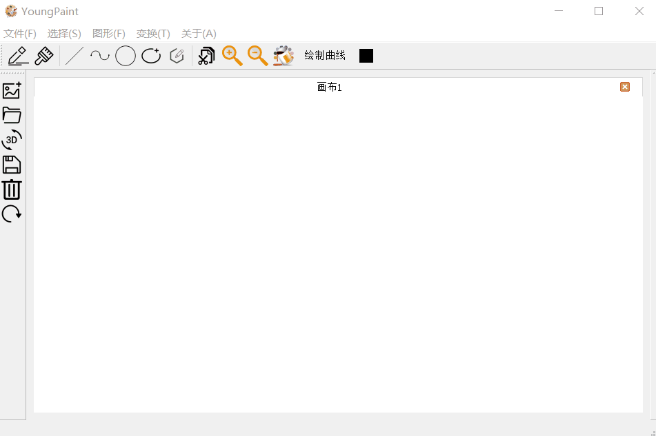

#### 4.12 清屏：

- 点击左侧工具栏清屏按钮，即可清屏

    

#### 4.13 颜色选择：

- 点击上方工具栏颜色选择按钮，即可选择颜色

    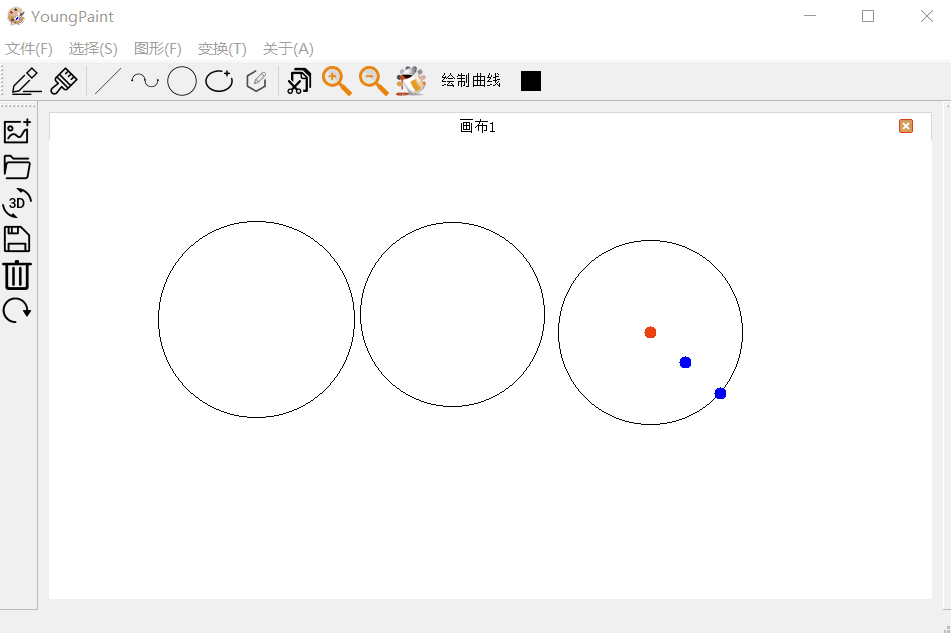

#### 4.14 打开文件：

- 点击左侧工具栏打开按钮，即可打开图片

    

#### 4.15 画笔和笔刷：

- 点击笔或者笔刷，即可自由绘图

    

#### 4.16关于：

- 点击关于,即可查看程序详情，点击链接可以查看详情。

    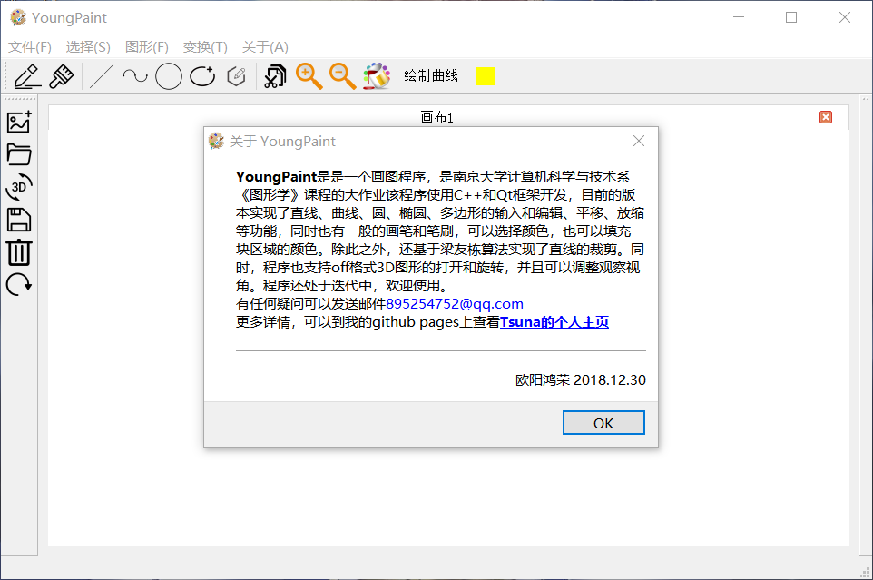

## 5.致谢

感谢孙正兴老师和张岩老师的辛勤教学，感谢各位助教在百忙之中解答我的各种疑惑，感谢我的舍友和系友们在关于大作业的各种问题给我的指导和帮助。

