# 《计算机图形学》系统技术报告

**欧阳鸿荣 161220096**

（南京大学 计算机科学与技术系 南京 210093）

【摘要】：本绘图系统采用了面向对象设计，以 C++为基础，使用 Qt的GUI框架，完成了图形学实验中要求的所有功能。实现了直线、曲线、圆、椭圆和多边形的输入，编辑和平移、旋转缩放等变换功能，同时实现了直线的裁剪、任意区域的填充以及二维图形的存储功能，能够将绘制出来的图形保存为图像。并且支持三维模型的显示，能够载入并显示一个OFF格式的三维模型。

[TOC]

<div STYLE="page-break-after: always;"></div>

## 1.综述

| 系统名     | 语言和框架     | IDE        | 编译器      |
| ---------- | -------------- | ---------- | ----------- |
| PaintYoung | C++和Qt 5.11.2 | Qt Creator | MinGW 5.3.0 |

该系统按照最初预期实现了**所有要求实现的功能**

### 1.1 基本功能：

1. ##### 二维图形的输入功能：

   - 直线、曲线、圆、椭圆、多边形的输入实现
     - 类画图软件，用鼠标交互
     - 直线实现了**Bresenham和DDA算法**
     - 曲线实现了**贝塞尔曲线**
     - 圆实现了**Bresenham和中点圆算法**
     - 椭圆实现了**中点椭圆算法**
   - 填充区域的输入
     - 实现了类似油漆桶的功能，使用的是**洪泛填充算法**
     - **鼠标点击区域**，洪泛填充与区域颜色相同的区域

2. ##### 二维图形的编辑功能：

   - 直线、曲线、圆，椭圆，多边形的编辑
     - 直线能编辑起点、终点
     - 曲线能编辑贝赛尔曲线的各个控制点
     - 圆能编辑半径
     - 椭圆能编辑长轴a和短轴b的长度
     - 多边形能编辑任意顶点
     - **鼠标点击拖动交互编辑**，更加自由

3. ##### 二维图形的裁剪功能

   - 实现直线的裁剪
     - 使用**梁友栋算法**对直线进行裁剪
   - 裁剪窗口可用鼠标点击拖动输入
   - **裁剪后的图形仍然可以编辑**

4. ##### 二维图形的变换功能

   - 直线、曲线、圆、椭圆、多边形的平移
   - 直线、曲线、圆、椭圆、多边形的旋转
     - **任意角度旋转**
     - 直线、圆的旋转实现了**精度控制**
       - 旋转次数不多的情况下，长度/半径误差在1以内
   - 直线、曲线、圆、椭圆、多边形的缩放
   - **对变换后的图形仍然可以编辑**

5. ##### 二维图形的存储功能

   - 可以将绘制出来的图形保存为图像

6. ##### 三维模型的显示功能

   - 可以载入并显示一个OFF格式的三维模型
   - 载入后可以通过键盘**控制观察的视角和三维模型的旋转**

### 1.2 扩展功能：

1. 画布的创建，多画布切换
2. 颜色的选择
3. 增加了画笔和笔刷的功能
4. 清屏和撤销的功能
5. 打开图片编辑的功能

### 1.3 演示

- 将项目打包成了一个.exe文件，放在本报告的该目录下供助教测试。
- 关于直线、圆等动态演示，可以通过该目录下的markdown或者html文件进行阅读，也可以在我的github个人主页查看 https://tsunaou.github.io/GraphicsYoung.html

<div>
    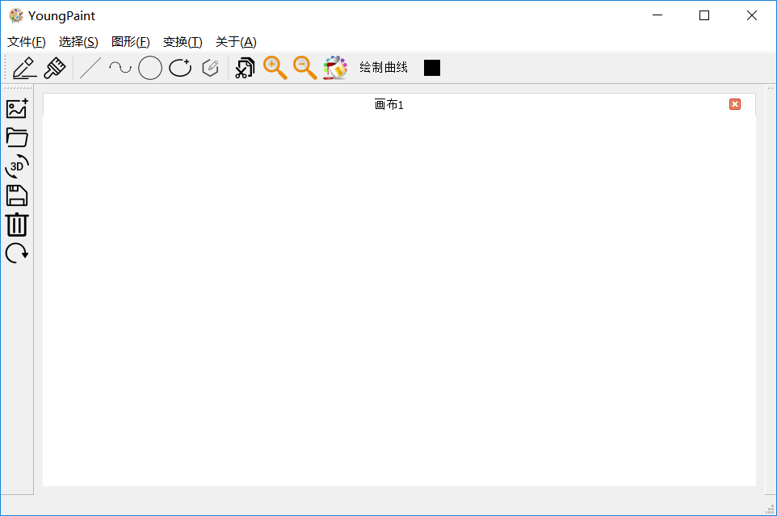
</div>
## <div STYLE="page-break-after: always;"></div>

## 2.算法介绍

### 2.1 直线绘制算法

#### 2.11 算法一：DDA直线算法

##### (1)基本原理

**数值差分分析DDA(digital differential analyzer)算法：**直接利用$\Delta x$或$\Delta y$的线段扫描转换算法，利用光栅特性(屏幕单位网格表示像素列阵)，使用$x$或$y$方向单位增量(用$\Delta x$或$\Delta y=±1$)来离散取样，并逐步计算沿线路径各像素位置。在一个坐标轴上以单位间隔对线段离散取样，确定另一个坐标轴上最靠近线段路径的对应整数值。

<div>
    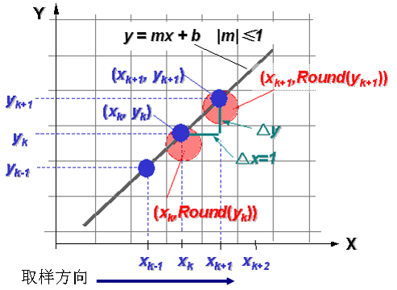
    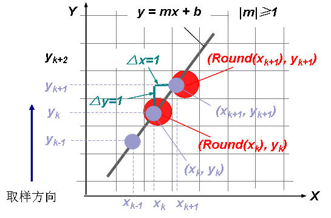
</div>

##### (2)理论绘制过程

**1.具有正斜率时**

**1.1 从左到右生成线段。**

若斜率 $m≤1$，在x方向以单位间隔$(△x=1)$取样，以增量形式顺序计算每个y值。下标k取整数值从k=1开始递增。$m$为0与1间的任意实数，计算出的坐标值必须取整。
$$
y_{k+1}=y_k+m \ \ \      (1)
$$
**1.2 从右端点到左端点生成线段**，取$△x=-1$
$$
y_{k+1}=y_k-m  \ \ \    (2)
$$
**1.3 若斜率m>1，从左到右生成线段。**在y方向以单位间隔$△y=1$取样，顺序计算每个x值。下标$k$取整数值从1开始递增，直至最后端点。计算出的坐标值必须取整。
$$
x_{k+1}=x_k＋\frac{1}{m} \ \ \       (3)
$$
**1.4 若从右到左生成线段**，取$△y=-1$
$$
x_{k+1}=x_k-\frac{1}{m}  \ \ \    (4)
$$

**2.具有负斜率时**

**2.1 假如斜率的绝对值小于1时，**

- 起始端点在左侧，设置$△x=1$并用方程(1)计算y；	
- 起始端点在右侧，设置$△x =-1$并用方程(2)得到y

**2.2 假如斜率的绝对值大于1时，**

- 起始端点在左侧，用$△y=1$和方程(3)，	
- 当起始端点在右侧，$△y= -1$和方程(4)。

##### (3)算法的C++实现

```c++
void LineController::MyDrawLineDDA(QPainter *painter, QPoint &start, QPoint &end)
{
    qDebug()<<"MyDrawLine DDA"<<endl;

    int x1 = start.x();
    int y1 = start.y();
    int x2 = end.x();
    int y2 = end.y();

    double dx=x2-x1;
    double dy=y2-y1;
    double e=(fabs(dx)>fabs(dy))?fabs(dx):fabs(dy);
    double x=x1;
    double y=y1;

    dx/=e;
    dy/=e;

    for(int i=1;i<=e;i++){
        QPoint temPt((int)(x+0.5), (int)(y+0.5));
        painter->drawPoint(temPt);
        x+=dx;
        y+=dy;
    }
}
```

#### 2.11 算法二：Bresenham直线算法

##### (1)基本原理

**Bresenham直线算法**是Bresenham提出的一种算法：采用整数增量运算，精确而有效的光栅设备线生成算法。它可用于其它曲线显示。根据光栅扫描原理(逐个像素和逐条扫描线显示图形)，线段离散过程中的每一放样位置上只可能有两个像素更接近于线段路径。Bresenham算法引入一个整型参量来衡量“两候选像素与实际线路径点间的偏移关系”。Bresenham算法通过对整型参量值符号的检测，选择候选像素中离实际线路径近的像素作为线的一个离散点。 

<div>
    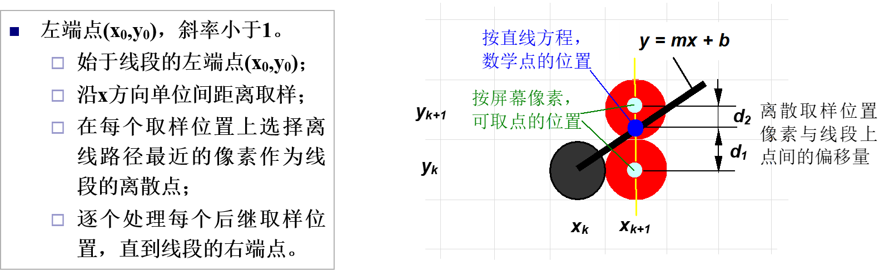
</div>

##### (2)理论绘制过程

假设直线由$n$+1个点组成，且起点到终点的坐标分别为：$(x_0,y_0),(x_1,y_1)...,(x_n,y_n)$，第$k$步的决策参数为$p_k$，则有纵坐标和决策参数的递推公式如下：
$$
y_{k+1}=\left\{
\begin{aligned}
&y_k,&p_k<0 \\
&y_k+1,&p_k \ge 0
\end{aligned}
\right.
\\
p_{k+1}=\left\{
\begin{aligned}
&p_k+2\Delta y,&p_k<0 \\
&y_{k+1}-2\Delta x,&p_k \ge 0
\end{aligned}
\right.
$$
**1.若斜率 $0\le m \le 1$，则有**

- 计算$\Delta x = x_k - x_0,\Delta y=y_k-y_0$
- 绘制直线左侧的起始点$(x_0,y_0)$，并计算初始决策变量$p_0=2\Delta y-2\Delta x$
- 根据上述的递推公式，从$x_0$出发，每次令$x+1$，并计算该$x$对应的$y、p_k$，直到$x_k$

**2.若斜率 $m>1$，则有**

- 仅需要将递增变量$x、x_k$改为$y、y_k$，再代入上述过程即可

**2.若斜率 $m<0$，则有**

- 仅需把上述递推公式中的$y_k+1$改为$y_k-1$，再代入上述过程即可

##### (3)算法的C++实现

```c++
void LineController::MyDrawLineBresenham(QPainter *painter, QPoint &start, QPoint &end)
{
    //首先先在这里实现我的直线算法
    qDebug()<<"MyDrawLine Bresenham"<<endl;

    int x1 = start.x();
    int y1 = start.y();
    int x2 = end.x();
    int y2 = end.y();

    int x,y,dx,dy,p;
    x=x1;
    y=y1;
    dx=x2-x1;
    dy=y2-y1;
    p=2*dy-dx;
    for(;x<=x2;x++)
    {
        QPoint temPt(x,y);
        painter->drawPoint(temPt);
        if(p>=0)
        {     y++;
            p+=2*(dy-dx);
        }
        else
        {
            p+=2*dy;
        }
    }
}
```

### 2.2 曲线绘制算法

####  贝塞尔曲线算法

##### (1)基本原理

贝塞尔曲线是通过一组多边折线的各个顶点唯一定义出来的。曲线的形状趋近于多边折线的形状。贝塞尔曲线可以拟合任何数目的控制顶点。一般通过$Bernstein$基函数多项式来描述贝赛尔曲线。
$$
Bez_{i,n}(u)=C_n^iu^i(1-u)^{n-i}
$$
则可以通过递归定义得到贝塞尔曲线上点的坐标
$$
BEZ_{i,n}(u)=(1-u)BEZ_{i,n-1}(u)+uBEZ_{i-1,n-1}(u)
$$
其中，$BEZ_{i,i}(u)=u^i,$,$BEZ_{0,i}(u)=(1-u)^i,$

##### (2)理论绘制过程

这里我主要简述**德卡斯特里奥(de Casteljau)算法**：该算法描述从参数$u$计算$n$次曲线贝塞尔型值点$P(u)$的过程。对于某一个特定的参数$u$，有计算公式如下：
$$
P_i^r=\left\{
\begin{aligned}
&P_i,&r=0 \\
&(1-u)P_i^{r-1}+uP_{i+1}^{r-1},&r=1,2,..,n;i=0,1,2,...n-r
\end{aligned}
\right.
$$
则当$r=0$时，计算结果为顶点本身。而曲线上的型值点为$P(u)=P_0^n$

<div>
    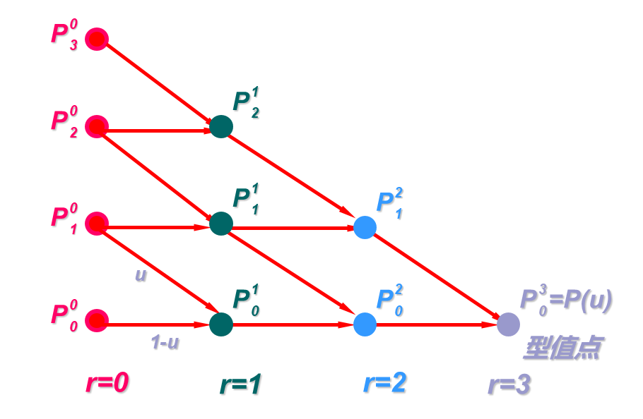
</div>

如上图是三次贝塞尔曲线在某个$u$值下的计算过程（$u$的变化生成多个离散型值点：$r=n+1$）

- 对应$r=0$的顶点是曲线的控制点
- 当$r$不断增加时，对应的顶点数递减直到$r=3$时只剩下一个顶点，即为所求的型值点。
- 在$r=1,2,3$各列中的每个点都有两个箭头指向它，代表该点是两箭头始点的线性组合，箭头标注的为权值。

由此，只需令$u$在0到1之间变化，则可以根据该原理绘制贝塞尔曲线。

##### (3)绘制的代码

由于曲线的代码量较大，因此这里没有直接给出。总的来说，用户从鼠标输入曲线的各个控制点并且选择曲线的绘制后，则对参数$t$，使得$t=0$的，递增步长为$0.01$的初始情况下，对每个$t$的控制点使用德卡斯特里奥算法，对$n$个控制点则通过$n-1$轮的递归，从而找到型值点。然后将各个型值点之间用直线连接做近似得到曲线。（修改$t$的递增步长，曲线会更为精准，但是与之相对的是速度更加缓慢）。效率与精度，这是一个值得思考的问题。

### 2.3 圆绘制算法

#### 2.31 算法一： 中点圆算法

##### (1)基本原理

中点圆算法通过决策参数，在候选像素中选择接近圆周的像素。避免平方根运算，直接采用像素与圆距离的平方作为判决依据。通过检验两候选像素中点与圆周边界的相对位置关系(圆周边界的内或外)来选择像素。

<div>
    
    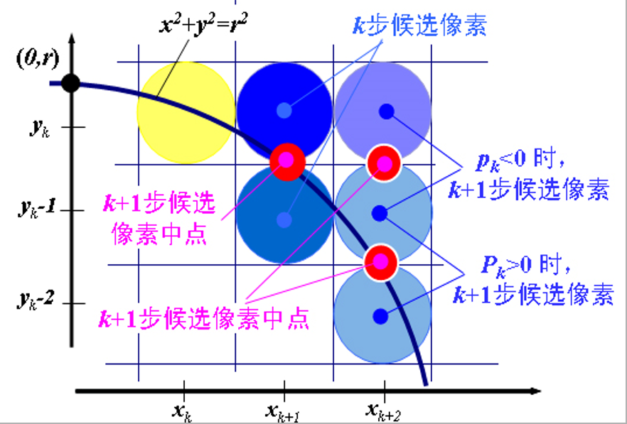
</div>

##### (2)优点

适应性强：易应用于其它圆锥曲线。误差可控：对于整数圆半径，生成与Bresenham算法相同的像素位置。且所确定像素位置误差限制在半个像素以内。

##### (3)理论绘制过程

根据圆的对称性，只绘制了八分之一圆，其余部分通过对称性即可得到坐标。使用经过改良的中点圆算法，使用递推，减少了计算量，并且避免了浮点运算。算法过程如下：

1. 输入圆半径r和圆心$(x_c,y_c)$，并得到圆心在原点的圆周上的第一点为 $(x_0,y_0)=(0,r)$

2. 计算圆周点$(0,r)$的初始决策参数值为：$p_0=\frac{5}{4}-r$

3. 从k=0开始每个取样位置$x_k$位置处完成下列检测

   - 若$p_k＜0$，选择像素位置：$(x_{k+1},y_k)$；且$p_{k+1}=p_k+2x_{k+1}+1$
   - 若$p_k>0$，选择像素位置：$(x_{k+1},y_k-1)$；且$p_{k+1}=p_k+2x_{k+1}+1-2y_{k+1}$
   - 其中有：$2x_{k+1}=2x_{k}+2,且 2y_{k+1}=2y_k-2$

4. 确定在其它七个八分圆中的对称点

5. 将计算出的像素位置$(x,y)$移动到中心在$(x_c,y_c)$的圆路径上，即：对像素位置进行平移

   $x=x+x_c,y=y+y_c$ 

   重复步骤3到5，直到$x>y$

##### (4)算法的C++实现

```c++
//中点圆算法
void CycleController::MyDrawCycle(QPainter *painter, QPoint &start, QPoint &end)
{
    //首先先在这里实现我的画圆算法
    qDebug()<<"MyDrawCycle "<<endl;
    int x0 = start.x();
    int y0 = start.y();
    double R = this->getLength(start,end);
    int x,y,p;
    x=0;
    y=R;
    p=3-2*R;
    for(;x<=y;x++)
    {
        this->drawEighthCycle(painter,x0,y0,x,y);
        if(p>=0){
           p+=4*(x-y)+10;
           y--;
        }else{
            p+=4*x+6;
        }
    }
}
//由于中点圆算法只对八分之一圆进行绘制，因此用该函数将八分之一圆投射成完整的圆
void CycleController::drawEighthCycle(QPainter *painter, int x0, int y0, int x, int y)
{
    QPoint temPt1(x0+x,y0+y);QPoint temPt2(x0+y,y0+x);
    QPoint temPt3(x0+x,y0-y);QPoint temPt4(x0+y,y0-x);
    QPoint temPt5(x0-x,y0-y);QPoint temPt6(x0-y,y0-x);
    QPoint temPt7(x0-x,y0+y);QPoint temPt8(x0-y,y0+x);

    painter->drawPoint(temPt1);painter->drawPoint(temPt2);
    painter->drawPoint(temPt3);painter->drawPoint(temPt4);
    painter->drawPoint(temPt5);painter->drawPoint(temPt6);
    painter->drawPoint(temPt7);painter->drawPoint(temPt8);
}

```

## <div STYLE="page-break-after: always;"></div>

#### 2.32 算法二： Bresenham 画圆算法

##### (1)基本原理

利用圆的对称性，我们只需要对一个八分圆进行扫描转换。如下图，如下图，在 $0≤x≤y $的 1/8 圆周上，像素坐标$x$ 值单调增加，$y$ 值单调减少。设第$i$步已确定$(x_i,y_i)$是要画圆上的象素点，看第$i+1$步象素点$(x_{i+1},y_{i+1})$应如何确定。下一个象素点只能是$(x_i+1,y_i)$或$(x_i+1,y_i-1)$中的一个 

<div>
    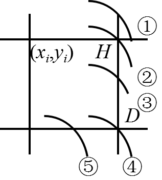
</div>

##### (2)理论绘制过程

有判别式如下：
$$
\begin{align}
&d_H=(x_i+1)^2+y_i^2-R^2\\
&d_D=R^2-(x_i+1)^2-(y_i-1)^2\\
&p_i=d_H-d_D
\end{align}
$$
则根据判别式，可以得到如下结果：

- 若精确圆弧为③，则$d_H >0$和$d_D>0$。
  - 若$p_i<0$，即$d_H <d_D$应选$H$点。
  - 若$p_i≥0$，即$d_H ≥d_D$应选$D$点。
-  若精确圆弧是①或②，显然$H$是应选择点，而此时$d_H ≤0，d_D>0$，必有$p_i<0$。
- 若精确圆弧是④或⑤，显然$D$是应选择点，而此时$d_H >0，d_D≤0$，必有$p_i>0$。

根据递推公式有：
$$
\begin{align}
&p_i=2(x_i+1)^2+2y_i^2-2y_i-2R^2+1\\
&p_{i+1}=p_i+2(y_{i+1}^2-y_i^2-y_{i+1}+y_i)+4x_i+6
\end{align}
$$
因此我们可以得到如下常规画法： $p_i$做判别量

- 当$p_i<0$时，选$H$点为下一个象素点。

  此时$y_{i+1}=y_i-1,p_{i+1}=p_i+4(x_i-y_i)+10$

- 当$p_i ≥0$时，选$D$点为下一个象素点。

  此时$p_{i+1}=p_i+4x_i+6$

##### (3)算法的C++实现

```c++
void CycleController::MyDrawCycleBresenham(QPainter *painter, QPoint &start, QPoint &end){
    //首先先在这里实现我的画圆算法
    qDebug()<<"MyDrawCycleBresenham "<<endl;
    int x0 = start.x();
    int y0 = start.y();
    double R = this->getLength(start,end);
    int x,y,p;
    x=0;
    y=R;
    p=3-2*R;
    for(;x<=y;x++)
    {
        this->drawEighthCycle(painter,x0,y0,x,y);
        if(p>=0){
           p+=4*(x-y)+10;
           y--;
        }else{
            p+=4*x+6;
        }
    }
}
```

### 2.4 椭圆绘制算法

####  中点椭圆算法

##### (1)基本原理

考虑椭圆沿长轴和短轴不同而修改圆生成算法来实现椭圆生成。

给定长短轴参数$r_x,r_y$(假设$r_x<r_y$)和椭圆中心位置$(x_c,y_c)$，利用平移：先确定中心在原点的标准位置的椭圆点$(x,y)$；然后将点变换为圆心在$(x_c,y_c)$的点。再利用对称性：生成第一象限内的椭圆弧，再利用对称性求出其它三个象限的对应点。


##### (2)理论绘制过程

根据椭圆的对称性，只绘制四分之一椭圆，其余部分通过对称性即可得到坐标。算法过程如下

1. 输入$r_x、r_y$和中心$(x_c,y_c)$，得到中心在原点的椭圆上的第一个点：$(x_0,y_0)=(0,r_y)$

2. 计算区域1中决策参数的初值为: $p1_0=r_y^2-r_x^2r_y+ r_x^2/4  $

3. 在区域1中每个$x_k$位置处，从k=0开始，完成下列测试

   - 若$p_{lk}＜0$，椭圆的下一个离散点为$(x_{k+1},y_k)$， 且：$pl_{k+1}=pl_k+2r_y^2x_k+1+r_y^2$。
   - 若$p_{lk}>0$，椭圆的下一个离散点为$(x_{k+1},y_k-1)$， 且：$p1{k+1}=pl_k+2r_y^2x_k-2r_x^2y_{k+1}+r_y^2$
   - 其中有：$2r_y^2x_{k+1}=2r_y^2x_k+2r_y^2；2r_x^2 y_{k+1}=2r_x^2y_k-2r_x^2$
   - 循环到：$2r_y^x \ge 2r_x^2y$

4. 使用区域1中最后点$(x_0,y_0)$计算区域2参数初值为$p2_0=r_y^2(x_0+1/2)^2+r_x^2 (y_0-1)-r_x^2r_y^2$  

   <div>
       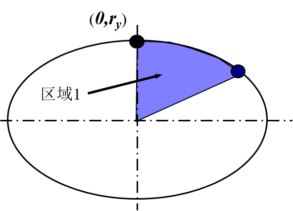
       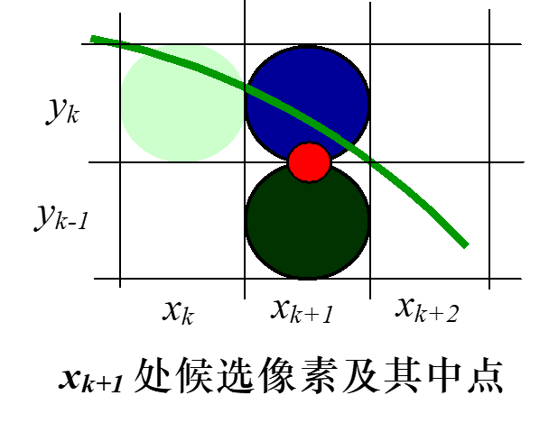
   </div>

5. 在区域2的每个$y_k$位置处，从k=0开始，完成下列检测

   - •假如$p2_k>0$，椭圆下一点选为$(x_k,y_k-1)$且：$p2_{k+1}=p2_k +3r_x^2-2r_x^2y$, 
   - •否则，沿椭圆的下一个点为$(x_{k+1},y_k-1)$, 且：$p2_{k+1}=p2_k+2r_y^2x-2r_x^y+2r_y^2+3r_x^2$
   - 使用与区域1中相同的x和y增量计算
   - 循环直至$(r_x,0)$

   <div>
       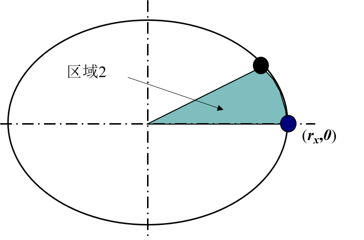
       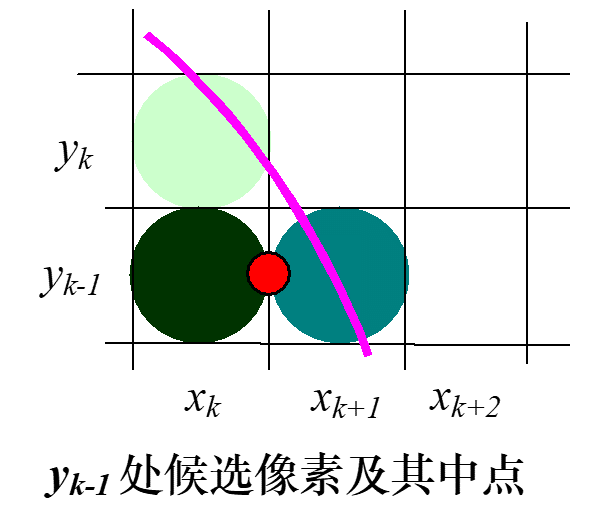
   </div>

6. 确定其它三个像限中对称的点。

7. 将每个计算出的像素位置$(x,y)平移到中心在$$(x_c,y_c)$的椭圆轨迹上，并且按照坐标之绘点$x=x+x_c,y=y+y_c$ 


##### (3)算法的C++实现

```c++
//由于中点椭圆算法只对四分之一椭圆进行绘制，因此用该函数将四分之一椭圆投射成完整的椭圆
void EllipseController::drawQuarterEllipse(QPainter *painter, int x0, int y0, int x, int y)
{
    QPoint temPt1(x0+x,y0+y);
    QPoint temPt2(x0+x,y0-y);
    QPoint temPt3(x0-x,y0+y);
    QPoint temPt4(x0-x,y0-y);

    painter->drawPoint(temPt1);
    painter->drawPoint(temPt2);
    painter->drawPoint(temPt3);
    painter->drawPoint(temPt4);
}

//中点椭圆算法
void EllipseController::MyDrawEllipse(QPainter *painter, QPoint &start, QPoint &end)
{
    //首先先在这里实现我的椭圆算法
    qDebug()<<"MyDrawEllipse "<<endl;
    int x0 = start.x(); //椭圆中心
    int y0 = start.y();
    int rx = abs(end.x()-x0); //椭圆长短轴
    int ry = abs(end.y()-y0);

    double rx_2 = rx*rx;
    double ry_2 = ry*ry;

    double pl = ry_2 - rx_2*ry + rx_2/4; //区域1中决策参数
    int x = 0;
    int y = ry;
    drawQuarterEllipse(painter,x0, y0, x, y);//第一个点

    //区域一 切线斜率k<=1
    while (ry_2*x <= rx_2*y){

        if (pl < 0){
            pl += 2*ry_2*x +3*ry_2;
        }else{
            pl += 2*ry_2*x - 2*rx_2*y + 2*rx_2+ 3*ry_2;
            y--;
        }
        x++;
        drawQuarterEllipse(painter,x0, y0, x, y);
    }
    //区域二 切线斜率k > 1
    //使用区域1中最后点(x0,y0)来计算区域2中参数初值
    pl = ry_2*(x+1/2)*(x+1/2)+rx_2*(y-1)*(y-1)-rx_2*ry_2;  

    while (y > 0){
        if (pl < 0){
            pl += 2*ry_2*x - 2*rx_2*y + 2*ry_2 + 3*rx_2;
            x++;
        }
        else{
            pl += 3*rx_2 - 2*rx_2*y;
        }
        y--;
        drawQuarterEllipse(painter,x0, y0, x, y);
    }
}


```

<div STYLE="page-break-after: always;"></div>

### 2.5 平移变换算法 

##### (1)基本原理

平移是将物体沿着直线路径从一个坐标位置到另一个坐标位置重定位。对于原始位置$P(x,y)$平移$d_x$和 $d_y$ 到新位置 $P(x_1,y_1)$的移动满足
$$
x1=x+d_x\\
y1=y+d_y
$$

##### (2)算法实现

给每一个图形都定义一个中心点（一般是对称中心或外接矩形的中心），绘制时加粗显示辅助，用户通过鼠标拖动中心点得到偏移量dx和dy。对于不同图形的平移，采取不同的实现方法：

1. 直线：对线上的起始点和顶点平移dx和dy，然后重新绘制
2. 圆：平移圆心和圆周上的点（决定半径），然后重新绘制
3. 椭圆：平移中心和外界矩形的一个顶点（决定a、b），然后重新绘制
4. 多边形：平移所有的顶点，然后重新绘制

##### (3)算法的C++实现

这里以直线的平移代码做例子，曲线、圆、椭圆和多边形原理相同。

用户实际使用时通过拖动图形的中心点进行平移。鼠标移动时，计算中心点横坐标和纵坐标的变化量，从而将图形中各个点都平移相同的偏差值，由此实现整个图形的平移。

```c++
void LineController::moveToPoint(Point point)
{
    int offsetX = point.getX() - curLine->centerPoint.getX();	//得到dx
    int offsetY = point.getY() - curLine->centerPoint.getY();	//得到dy
    curLine->setStartPoint( //对起点平移dx，dy
        Point(curLine->startPoint.getX()+offsetX,curLine->startPoint.getY()+offsetY));
    curLine->setEndPoint(	//对终点平移dx，dy
        Point(curLine->endPoint.getX()+offsetX,curLine->endPoint.getY()+offsetY));
    MyDrawLineDDA(painter,curLine->startPoint.point,curLine->endPoint.point);//重新绘制
    drawHandle(painter,pen);
}
```

<div STYLE="page-break-after: always;"></div>

### 2.6 旋转变换算法 

##### (1)基本原理

旋转是沿$xy$平面内圆弧路径重定位。指定旋转基准点位置$(x_r,y_r)$旋转$\theta$角，对任意基准位置的旋转
$$
x1=x_r+(x-x_r)cos\theta-(y-y_r)sin\theta\\
y1=y_r+(x-x_r)sin\theta+(y-y_r)cos\theta\\
$$

##### (2)算法实现

给每一个图形都定义一个旋转点，绘制时加粗显示辅助，用户通过鼠标拖动中心点得到旋转角$\theta$

对于不同图形的旋转，采取不同的实现方法：

1. **直线**：直线的旋转点定义为四等分点。
   - 用户操作旋转点，得到旋转角，然后对直线的两端点旋转，然后重新绘制
2. **圆**：圆的旋转点定义为在$r/2$的位置。（圆的旋转没必要就是了）
   - 用户操作旋转点，得到旋转角，然后对圆周上的点旋转，然后重新绘制
3. **椭圆**：椭圆的旋转点相对于其他图形略有不同。
   - 由于椭圆的中点椭圆算法只能实现对称轴垂直或者平行坐标轴的椭圆，因此在不引入其他算法的情况下，椭圆的旋转我定义了一个“偏向角$\alpha$”来付诸实现。
     - $\alpha$的初始值为0，为了方便叙述，假设椭圆中心为$(0,0)$，对旋转点$(x_m,y_m)$，为向量$(0,1)$与$(x_m,y_m,)$的夹角，而实际处理时为了方便，当夹角超过$\pi/2$时，对$\alpha$取负
     - 从而每次旋转时，只是对椭圆的旋转角做出了改变，但是实际上椭圆Ellipse类的对象中椭圆的关键信息并没有改变，只是每次绘制时，对椭圆的每个顶点都旋转$\alpha$角，这样就实现了旋转。与此同时，编辑的时候对编辑点也通过$\alpha$转化为未旋转前椭圆的编辑，这样让旋转后的椭圆也能够编辑
     - 但是此方法有一个缺陷，就是椭圆的旋转由于是对点的旋转实现的，因此椭圆会变得稀疏，或者说变成不连续的椭圆。我解决这个的办法是每次绘图时画2个像素增加椭圆边界的宽度。
4. **多边形和曲线**：多边形和曲线的旋转点定义与椭圆类似，但是也有区别
   - 由于多边形的绘制是对各个端点连线，曲线的绘制是由各个控制点决定的（因为我实现的是贝赛尔曲线），因此每次都对图形旋转$\alpha$的差值，但是旋转时保持旋转中心不动

##### (3) C++实现实现

这里主要介绍旋转时用到的一些辅助函数

**(1) 角度函数**：对于点A绕着点CENTER旋转到点B的情况，用余弦定理得到角$\beta$

```C++
double FigureController::getRotaryAngle(Point center, Point a, Point b)
{
    double ab = a.distanceToPoint(b.getQPoint());
    double ac = a.distanceToPoint(center.getQPoint());
    double bc = b.distanceToPoint(center.getQPoint());
    qreal cosC = (bc*bc+ac*ac-ab*ab)/(2*bc*ac);
    double theta = qAcos(cosC);
    return theta; //弧度制
}
```

**(2) 顺逆时针判断函数**：$\beta$这并不是真正的旋转角，故通过判断顺逆时针来对$\beta$进行修正得到$\theta$角（通过线性规划）

```c++
bool FigureController::clockWise(Point center, Point a, Point b)
{
    //k=0
    if(center.getY()==a.getY()){
        if(a.getX()>center.getX())// -------->型向量
        {
            if(b.getY() > a.getY()){
                return true;
            }else{
                return false;
            }
        }
        else// <--------型向量
        {
            if(b.getY() < a.getY()){
                return true;
            }else{
                return false;
            }
        }
    }
    //k不存在
    if(center.getX()==a.getX()){
        if(a.getY()<center.getY())//竖直向上
        {
            if(b.getX()>a.getX()){
                return true;
            }else{
                return  false;
            }
        }
        else //竖直向下
        {
            if(b.getX()<a.getX()){
                return true;
            }else{
                return  false;
            }
        }
    }
    //斜率存在切不为零
    double x0 = 0;
    double y0 = 0;
    double x1 = a.getQPoint().x() - center.getQPoint().x(); //把中点当原点
    double y1 = a.getQPoint().y() - center.getQPoint().y(); //把中点当原点
    double k = (y1-y0)/(x1-x0);
    double x2 = b.getX() - center.getX();   //把中点当原点（要用坐标直接比较还得标准化）
    double y2 = b.getY() - center.getY();   //把中点当原点
    if(a.getX()>center.getX())//方向向右
    {
        if(y2>(k*x2)){ //y > kx
            return true;
        }else{
            return false;
        }
    }
    else //方向朝左
    {
        if(y2<(k*x2)){ //y > kx
            return true;
        }else{
            return false;
        }
    }
}
```

根据旋转方向对$\beta$处理得到旋转角$\theta$，便可以对点进行旋转

**(3) 旋转误差修正函数**：

这是在实现圆的旋转后（虽然圆的旋转并无意义，但是起码放大了精度损失这个问题）发现的，由于旋转具有一定的精度损失（像素点都是整数的坐标），因此当精度累积后，可能会导致旋转失真甚至图形不断放大或者缩小。因此我采取了3个措施来实现旋转误差的修正：

（1）旋转时，在double转int时加上修正参数0.5

（2）其中ROTATE_ACCURACY是误差的容许值，ridus是旋转前圆的半径，x，y分别是旋转后的点。由于绕着圆心旋转，因此就寻找以$(x,y)$的附近在点集$(x\pm ROTATEA\_CCURACY,y\pm ROTATEA\_CCURACY)$的范围内到圆心距离与原半径误差最小的点。这样确保了误差不会太大

```c++
Point CycleController::getTheAccurayRotatePoint(qreal ridus, int x, int y)
{
    int resX = x-ROTATE_ACCURACY;
    int resY = y-ROTATE_ACCURACY;
    double minDiff =100;
    for(int i=x-ROTATE_ACCURACY;i<=x+ROTATE_ACCURACY;i++){
        for(int j=y-ROTATE_ACCURACY;j<=y+ROTATE_ACCURACY;j++){
            Point tmp(i,j);
            double diffTmp = fabs(this->cycle->centerPoint.distanceToPoint(tmp.getQPoint())-ridus);
            if(diffTmp<minDiff){
                resX=i;
                resY=j;
                minDiff = diffTmp;
            }

        }
    }
    return Point(resX,resY);
}
```

（3）由于半径的计算也有误差，因此在一次旋转中，对每次求得的半径取平均，以求达到稳定。

基于上述算法，**后期对于直线的旋转也进行了相应的校正处理**

<div STYLE="page-break-after: always;"></div>

### 2.7 放缩变换算法 

##### (1)基本原理

我实现的是相对于原点的缩放。将每个顶点坐标乘以缩放系数$s_x,s_y$到得到新坐标 $(x_1,y_1)$的移动满足

$$
x1=x\cdot s_x\\
y1=y\cdot s_y
$$

##### (2)算法实现

1. **直线**：对线上的起始点和顶点放缩，然后重新绘制
2. **圆**：放缩圆心和圆周上的点（决定半径），然后重新绘制
3. **椭圆**：放缩中心和外界矩形的一个顶点（决定a、b），然后重新绘制
4. **多边形和曲线**：放缩所有的顶点，然后重新绘制

##### (3)算法的C++实现

这里采用直线的做例子,其中```ZOOM_IN```和```ZOOM_OUT```是缩放参数，在constparam.h中定义，两者互为倒数。这里对于自定义的Point类重载了其乘法，得以直接对坐标进行变换

```c++
void LineController::setBigger(QPainter* painter, QMouseEvent *e, QPen pen){
    this->curLine->setStartPoint(this->curLine->startPoint*ZOOM_IN);	//乘以放大系数
    this->curLine->setEndPoint(this->curLine->endPoint*ZOOM_IN);		//乘以放大系数
    MyDrawLineDDA(painter,curLine->startPoint.point,curLine->endPoint.point);
    drawHandle(painter,pen);
}
void LineController::setSmaller(QPainter* painter, QMouseEvent *e, QPen pen){
    this->curLine->setStartPoint(this->curLine->startPoint*ZOOM_OUT);	//乘以缩小系数
    this->curLine->setEndPoint(this->curLine->endPoint*ZOOM_OUT);		//乘以缩小系数
    MyDrawLineDDA(painter,curLine->startPoint.point,curLine->endPoint.point);
    drawHandle(painter,pen);
}
```

<div STYLE="page-break-after: always;"></div>

### 2.8 泛滥区域填充算法

##### (1)基本定义

泛滥填充算法：区域内部用单一颜色定义的区域填充。通过替换指定的内部颜色来对这个区域着色(填充)。

##### (2)填充算法

从种子点开始，按像素连通定义，递归检测和扩展区域内部像素，并将填充颜色赋给这些像素，直到所有内部点均被着色。

##### (3)C++代码实现

泛滥填充算法实际上思路很简单，我目前实现是类似windows画图程序的油漆桶功能，即鼠标点击一个点$(x,y)$，则按照**4连通**定义，递归检测，对其连通区域中与$(x,y)$颜色相同的像素点赋予用户选择颜色。

**但是泛滥填充算法的效率和对于栈的要求比较高，因此我对其进行了一些优化**

(1）定义```bool processed[]```数组，大小为整个区域，表示是否处理过，这样对于处理过的点可以不在判断

(2)  改递归为循环，用一个栈stack存储待处理的点，处理后将未处理过的且四连通的的颜色与底色相同的点入栈，每次对出栈的点处理，一直填充直到栈为空

(3)  将栈stack定义在堆区，减少对系统栈的使用负担

```c++
stack->clear();
stack->push(QPoint(cx,cy));    
while(!stack->empty()){
    QPoint p = stack->pop();
    int x = p.x();
    int y = p.y();

    if(x<=0 || x>=pix->width()-2) continue;     //超限
    if(y<=0 || y>=pix->height()-2) continue;    //超限
    if(img->pixelColor(x,y) != backcolor) continue;   //边界
    if(processed[x][y] == true) continue;      //上色过了
    processed[x][y] = true;	//标记，代表处理过了
    painter->drawPoint(x,y);
    if(!processed[x][y+1]){
        stack->push(QPoint(x,y+1));
    }
    if(!processed[x][y-1]){
        stack->push(QPoint(x,y-1));
    }
    if(!processed[x-1][y]){
        stack->push(QPoint(x-1,y));
    }
    if(!processed[x+1][y]){
        stack->push(QPoint(x+1,y));
    }
}
stack->clear();

```

<div STYLE="page-break-after: always;"></div>

### 2.8 直线裁剪算法

#### 梁友栋-Barsky参数裁剪算法

##### (1)基本原理

对于直线段$P_1(x_1,y1),P_2(x_2,y2)$，可以用参数方程形式表示
$$
x = x_1+u(x_2-x_1) =x_1+\Delta x\\
y = y_1+u(y_2-y_1) =y_1+\Delta y\\
$$
若有$P(x,y)$位于由$(xmin,ymin),(xmax,ymax)$所构成的裁剪窗口内，则有下式成立
$$
xmin\le x1+u \cdot\Delta x \le xmax\\
ymin\le y1+u \cdot\Delta y \le ymax
$$
这四个不等式可以表达为
$$
u\cdot p_k\leq_k,k=1,2,3,4
$$
其中，$p,q$被定义为
$$
\begin{aligned}
&p_1=-\Delta x,q_1=x1-xmin\\
&p_2=\Delta x,\ \ \  q_2=xmax-x1\\
&p_3=-\Delta y,q_3=y1-ymin\\
&p_4=\Delta y,\ \ \  q_4=ymax-x1
\end{aligned}
$$
则有以下结论:

平行于窗口某边界的直线，其$p_k=0$，$k$值对应于相应的边界（$k=1，2，3，4$对应于左、右、下、上边界）。

1. 如果  $q_k<0$，则线段完全在边界外，应舍弃该线段。
2. 如果  $q_k≥0$，则线段平行于窗口某边界并在窗口内。
3. 如果 $p_k<0$，则线段从裁剪边界延长线的外部延伸到内部；
4. 如果 $p_k>0$，则线段从裁剪边界延长线的内部延伸到外部

当$\Delta x\ge 0$时

1. 对于左边界$p_1<0（p_1=-Δx）$，线段从左边界的外部到内部；
2. 对于右边界$p_2>0（p_2=Δx）$，线段从右边界的内部到外部

当$\Delta y < 0$时

1. 对于下边界$p_3>0（p_3=-Δy）$，线段从下边界的内部到外部；
2. 对于上边界$p_4<0（p_4=Δy）$，线段从上边界的外部到内部

当$p_K≠0$时，可以计算出参数u的值，它对应于无限延伸的直线与延伸的窗口边界k的交点
$$
u=q_k/p_k
$$
对于每条直线，可以计算出参数$u_1$和$u_2$，该值定义了位于窗口内的线段部分：

1. $u_1$的值由线段从外到内遇到的矩形边界所决定$（p_k<0）$，对这些边界计算$r_k=q_k/p_k$，$u_1$取0和各个$r$值之中的最大值。
2. $u_2$的值由线段从内到外遇到的矩形边界所决定$（p_k>0）$，对这些边界计算$r_k=q_k/p_k$，$u_2$取1和各个$r$值之中的最小值。
3. 如果$u1>u2$，则线段完全落在裁剪窗口之外，应当被舍弃；否则，被裁剪线段的端点可以由$u1$和$u2$计算出来。

##### (2)优点——与Cohen-Sutherland算法的比较

与Cohen-Sutherland算法相比，梁友栋-Barsky算法减少了交点计算次数：

（1）梁友栋-Barsky

- 更新参数$u_1、u_2$仅需一次除法；
- 线段与窗口的交点仅计算一次就计算出$u_1、u_2$的最后值。

（2）Cohen-Sutherland算法

- 即使对完全落在裁剪窗口之外的一条线段，也要对它反复求交点，而且每次求交计算都需要除法和乘法运算。

##### (3)算法过程

1. 参数初始化：线段交点初始参数分别为：$u_1=0，u_2=1$。
2. 定义判断函数
   - 用$p、q$来判断：是舍弃线段？还是改变交点参数r
     - $p＜0$，参数$r$用于更新$u_1$
     - $p＞0$，参数$r$用于更新$u_2 $
   - 更新后的判断
     - 若更新$u_1$或$u_2$后，使$u_1$＞$u_2$，则舍弃该线段
     - 否则，更新$u$值仅仅是求出交点、缩短线段
3. 求解交点参数
   - 测试四个$p、q$值后，若该线段被保留，则裁剪线段的端点由$u_1、u_2$值决定
   - $p=0且q＜0$时，舍弃该线段
4. 反复执行上述过程，计算各裁剪边界的$p，q$值进行判断。

#### (4)算法的C++实现

```c++
bool LineController::cutLineLiangBsrsky(QPoint cutStart, QPoint cutEnd, QPainter *painter, QPen pen)
{
    //在这里进行判断
    //对裁剪窗口预处理
    double xmin = std::min(cutStart.x(),cutEnd.x());
    double ymin = std::min(cutStart.y(),cutEnd.y());  
    double xmax = std::max(cutStart.x(),cutEnd.x());
    double ymax = std::max(cutStart.y(),cutEnd.y());
    //得到待裁剪直线的各个端点
    double x1 = curLine->startPoint.getX();
    double y1 = curLine->startPoint.getY();
    double x2 = curLine->endPoint.getX();
    double y2 = curLine->endPoint.getY();
    //各个参数的定义
    double dx = x2-x1;  //△x
    double dy = y2-y1;  //△y
    double p[4] = {-dx,dx,-dy,dy};
    double q[4] = {x1-xmin,xmax-x1,y1-ymin,ymax-y1};
    double u1 = 0;
    double u2 = 1;

    //梁友栋裁剪算法，对p和q进行判断
    for(int i=0;i<4;i++){

        if(fabs(p[i])<1e-6 && q[i]<0){  //p=0且q＜0时，舍弃该线段
            this->clearState();
            return false;
        }

        double r = q[i]/p[i];
        if(p[i]<0){
            u1 = r>u1?r:u1; //u1取0和各个r值之中的最大值
        }else{
            u2 = r<u2?r:u2; //u2取1和各个r值之中的最小值
        }

        if(u1>u2){  //如果u1>u2，则线段完全落在裁剪窗口之外，应当被舍弃
            this->clearState();
            return false;
        }
    }

    curLine->setStartPoint(Point(x1+int(u1*dx+0.5), y1+int(u1*dy+0.5)));
    curLine->setEndPoint(Point(x1+int(u2*dx+0.5), y1+int(u2*dy+0.5)));
    MyDrawLineDDA(painter,curLine->startPoint.point,curLine->endPoint.point);
    drawHandle(painter,pen);

    return true;

}
```

<div STYLE="page-break-after: always;"></div>

## 3.系统介绍

### 3.1 实验环境

| 操作系统（运行平台） | Windows 10  |
| -------------------- | ----------- |
| 开发语言             | C++         |
| 开发环境             | Qt Creator  |
| 编译环境             | MinGW 5.3.0 |

### 3.2 系统组织

本系统使用Qt提供图形界面，通过Qt集成的QOpenGLWidget类来提供画布，实验主要分为以下类（PDF版本中表格在下一页，可能有些影响阅读体验，还请见谅）

| 类名              | 继承于           | 类功能                                                       |
| ----------------- | ---------------- | ------------------------------------------------------------ |
| MainWindow        | QMainWindow      | 提供整个系统的框架，并提供基础功能，如选择绘图类型（目前是直线，圆，椭圆），撤销，清屏，新建图像，保存图像等选项，是交互的窗口。 |
| Canvas_GL         | QOpenGLWidget    | 每个Canvas_GL类都是一个绘图的画布，用户在上面绘图            |
| Canvas_3DGL       | Canvas_GL        | 每个Canvas_3DGL类提供3D图形的显示和控制功能                  |
| ColorPanel        | QWidget          | 尚未完全实现，用于提供更为便捷的功能选择                     |
| FigureController  |                  | 图形控制的接口，用于定义绘图行为（目前只有绘制，后期预计在此接口上实现更多功能） |
| LineController    | FigureController | 控制直线的输入和编辑，实现了DDA直线算法                      |
| CycleController   | FigureController | 控制圆的输入和编辑，实现了中点圆和Bresenham画圆法            |
| EllipseController | FigureController | 控制椭圆的输入和编辑，实现了中点点椭圆绘制算法               |
| PolygonController | FigureController | 控制了多边形输入和编辑                                       |
| CurveController   | FigureController | 控制了曲线的输入和编辑                                       |
| Figure            |                  | 图形类的基类，用于记录画过的图形，便于后期操作               |
| Line              | Figure           | 直线，记录了直线的起点和终点                                 |
| Cycle             | Figure           | 圆，记录了圆心和半径（实际上是圆周的任意一点）               |
| Ellipse           | Figure           | 椭圆，记录了代表长短轴的矩形（其实是中心和矩形顶点）         |
| Polygon           | Figure           | 多边形，记录了多边形的各个顶点坐标                           |
| Curve             | Figure           | 曲线，记录了曲线的各个顶点坐标                               |
| Point             |                  | 点，集成了QPoint，对于关于点的一些常用操作进行抽象集成       |
| PointD            |                  | 和Point类相似，区别在于其坐标为浮点，用于精度的控制          |

<div STYLE="page-break-after: always;"></div>

#### 3.2.1 系统结构和类关系图

<div>
    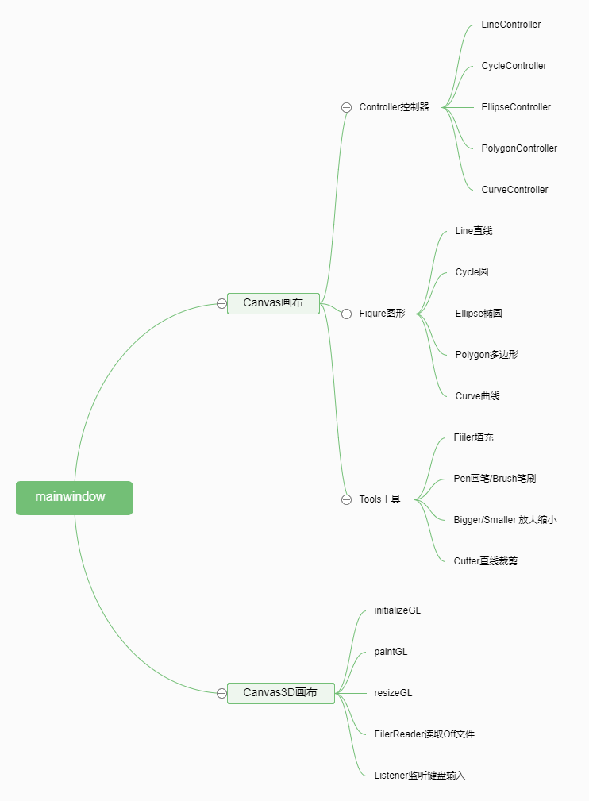
</div>


为了实现对图形的编辑，我定义了FigureController类和Figure类，并由这两个类继承衍生出具体图形和其控制器。Figure用于图元的存储，FigureController用于图元的编辑等一系列操作。

<div>
    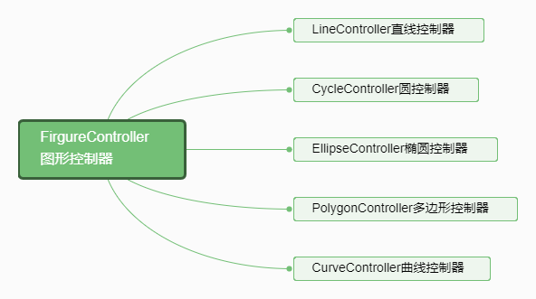
    
</div>

这里给出FigureController的定义,用了许多虚函数，这样利于在Canvas中统一操作，优化代码结构

```c++
class FigureController
{
public:
    FigureController();
    //抽象函数
    virtual void mousePressEvent(QPainter* painter, QMouseEvent *e, QPen pen) =0;
    virtual void mouseMoveEvent(QPainter* painter, QMouseEvent *e, QPen pen) =0;
    virtual void mouseReleaseEvent(QPainter* painter,QMouseEvent *e,  QPen pen) =0;
    virtual bool isOperationing(QMouseEvent *e,QPoint &start,QPoint &end)=0;    //判断是否有在对图形进行绘制操作
    virtual void setStartPoint(Point point) =0; //设置起始点
    virtual void setEndPoint(Point point) =0;   //设置终点
    virtual void moveToPoint(Point point) =0;   //平移
    virtual void rotateToPoint(Point point) =0; //旋转
    virtual void setState(DRAW_STATE *state) =0;    //设置状态
    virtual void drawHandle(QPainter* painter, QPen pen) =0;    //描绘辅助信息
    virtual void clearState() =0;   //情况状态
    virtual void getStartAndEnd(QPoint &start,QPoint &end) =0;
    virtual void setBigger(QPainter* painter, QMouseEvent *e, QPen pen) =0;   //放大
    virtual void setSmaller(QPainter* painter, QMouseEvent *e, QPen pen) =0;  //缩小
    //非抽象函数
    double getRotaryAngle(Point center,Point a,Point b); //得到夹角（返回值是弧度）
    bool clockWise(Point center,Point a,Point b);    //判断是否顺时针
    double getLength(QPoint &start,QPoint &end);    //得到两点间距离
    void drawOutlineToDebug(QPainter* painter,QPoint &start,QPoint &end);   //描绘轮廓
    void drawOutlineToDebug(QPainter* painter,QPoint a,QPoint b,QPoint c,QPoint d);   //描绘轮廓
    void printCtrlDebugMessage(QString msg){
        qDebug()<<msg<<endl;
    }

//protected:
    QPainter *painter;  //画板
    QPen pen;           //画笔
    DRAW_STATE *state;  //绘画状态
};
```

#### 3.2.2程序基本流程

1. 系统主题框架类：MainWindow，内集成一个画布类Canvas_GL的数组
2. 每次创建新画布，就显示新创建的画布
   - 画布可以自由切换
   - 选择功能时，对所有的画布都生效
   - 每个画布中都集成了各种图形的Controller
   - 撤销、清空、保存功能都对当前活动的画布（活动窗口）处理，不影响其他窗口
3. 画布接受事件输入
   - 对于工具栏的输入，由最外层的MainWindow向当前活跃状态的Canvas_GL传递相应消息。
   - 通过接受鼠标事件，对基本图形输入，编辑
     - 共性通过对应图形的Controller的对应函数来处理，这里用到了动态绑定来精简代码
       - mousePressEvent
       - mouseMoveEvent
       - mouseReleaseEvent
     - 对图形的特殊性质特别处理
   - 对于画笔和笔刷，将每次move的点通过直线连起来
   - 填充功能直接对鼠标点击区域填充
   - 裁剪目前只对直线有效，鼠标输入裁剪框，点击裁剪按钮即可裁剪
4. 3D画布
  - 3D画布继承于2D普通画布，能够读取off文件进行显示
  - 用户可以通过方向键和数字键1235（按方向键顺序）输入，画布的键盘监听器对其处理，从而能够对3D图像的显示控制观察角度和旋转角度。

## <div STYLE="page-break-after: always;"></div>

## 4.性能测试

为了更好地展现测试效果，我采用GIF图的形式。但是PDF不能显示GIF，因此还麻烦助教能够打开我提供的markdown版本或者html版本查看更为详细的报告。如有不便，十分抱歉。

对于性能测试，我主要对基本图形和填充功能进行测试。

#### 4.1 直线测试

- 直线的输入测试：可以输入任何斜率，任意大小的直线：

  <div>
      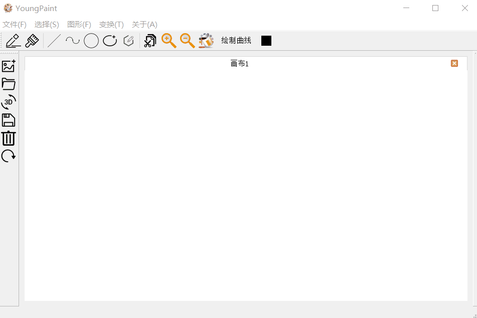
  </div>

- 直线的编辑测试：可以编辑直线的顶点

  <div>
      
  </div>

- 直线的变换测试：可以对直线进行平移、旋转与缩放

  <div>
      
  </div>

- 直线的裁剪测试：针对任意斜率的直线与任意裁剪窗口，都可以正常裁剪并且继续编辑

  <div>
      
  </div>

#### 4.2 曲线测试

- 曲线的输入测试：可以输入任意顶点数目的贝塞尔曲线：

  <div>
      
  </div>

- 曲线的编辑测试：可以编辑曲线的各个控制顶点

  <div>
      
  </div>

- 曲线的变换测试：可以对曲线进行平移、旋转与缩放

  <div>
      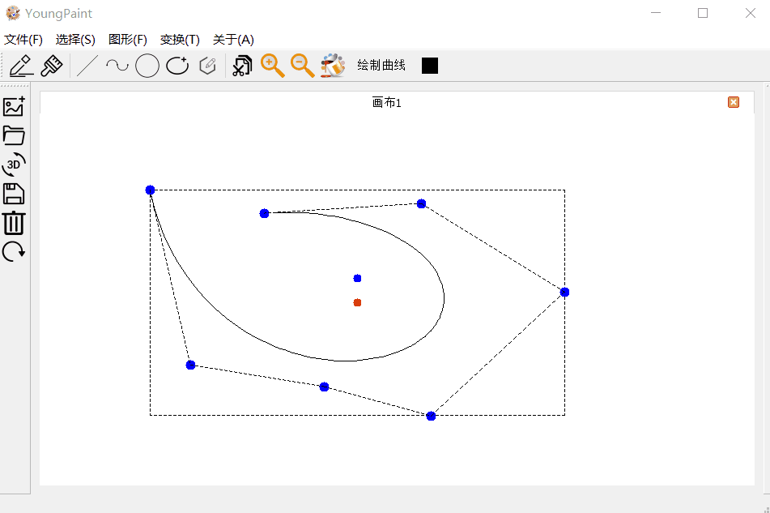
  </div>

#### 4.3 圆测试

- 圆的输入测试：可以输入圆心任意位置，半径任意大小的圆：

  <div>
      
  </div>

- 圆的编辑测试：可以编辑圆的半径

  <div>
      
  </div>

- 圆的变换测试：可以对圆进行平移、旋转与缩放

  <div>
      
  </div>

#### 4.4 椭圆测试

- 椭圆的输入测试：可以输入中心任意位置，任意大小的椭圆：

  <div>
      
  </div>

- 椭圆的编辑测试：可以编辑椭圆的大小

  <div>
      
  </div>

- 椭圆的变换测试：可以对椭圆进行平移、旋转与缩放

  <div>
      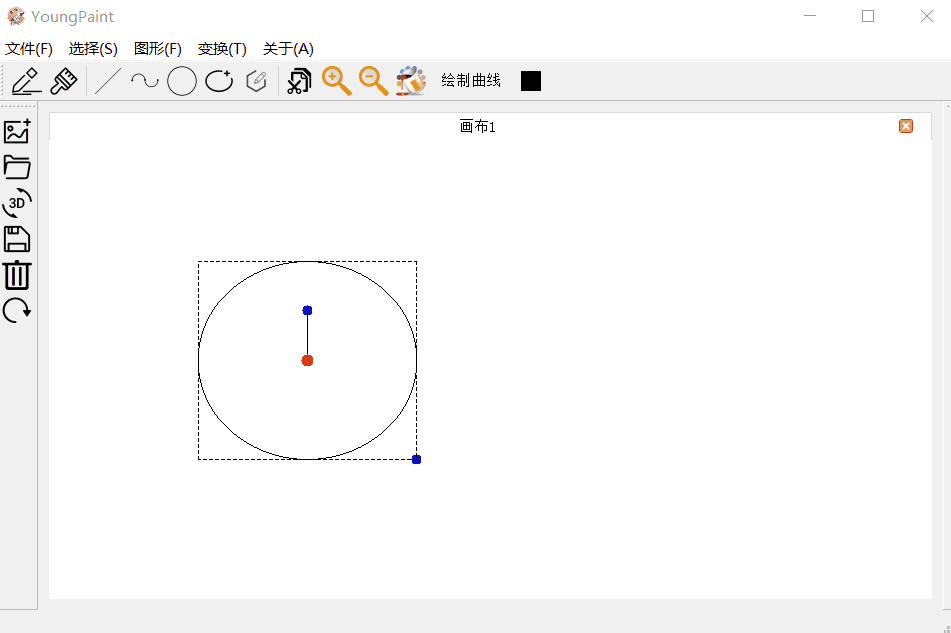
  </div>

#### 4.5 多边形测试

- 多边形的输入测试：可以输入任意顶点数目的多边形：

  <div>
      
  </div>

- 多边形的编辑测试：可以编辑多边形的各个顶点

  <div>
      
  </div>

- 多边形的变换测试：可以对多边形进行平移、旋转与缩放

  <div>
      
  </div>

#### 4.6 填充测试

<div>
    
</div>
<div STYLE="page-break-after: always;"></div>

## 5.总结

本绘图系统名为YoungPaint，基于C++和Qt 5.11.2，于Qt Creator上开发，编译环境为MinGW 5.3.0

在9-10月关于图形学的学习中，基于我在课上所学的理论知识，以及课外对于Qt的交互、界面设计的学习，在截止10月底的系统中，我实现了二维图形中直线，圆以及椭圆的输入，并且实现创建多个窗口，画笔颜色的选择，绘画的撤销以及图像的保存功能。

在11月的学习中，我增加了多边形的输入，增加了直线、圆、椭圆的编辑、平移、旋转、放缩功能，实现了填充和直线的裁剪。完善了图片打开的接口，并且优化了系统结构和UI设计，并增加了一些说明。

这次实验是我第一次写具有图形交互的的实验，感觉十分有趣。把图形学课上的理论同实践相结合并且不断探索，不断阅读各种文档资料学习新知识的感觉也不错。尤其是双缓冲绘图的实现，起初我为了实现类似画图程序的动态效果而自己实现了一个，后来听同学说这就是双缓冲技术，独立探索出了这样的技巧让我感觉我的确是有在学习东西的，这也让我对于该实验有着更大的兴趣。尽管由于其他原因，10月份的程序不能说尽善尽美，但是基于我对于程序的理解，一遍上着《高级程序设计》课学习C++各种高级性质，我尽可能把我的知识和设计体现在代码上。11月份中，基于《高级程序设计》课上的知识，对系统的结构进行了优化，定义了一些继承和抽象关系，让程序更加面向对象，也相对更好维护一些。同时，Figure类的定义，对后期保存所有图形并对其进行处理提供了可能。

12月中，主要增加了曲线的绘制和3D图形功能，同时针对之前系统的各种不稳定状态做了微型调整，使得系统的鲁棒性和可用性更高。整个实验过程中，各种技术和知识的学习贯穿其中。绘制算法的学习和编程语言和框架的学习，我尽可能将我所学用在了我的程序中，这个大作业也算是我的知识的结晶了。

## 6.致谢

感谢孙正兴老师和张岩老师的辛勤教学，感谢各位助教在百忙之中解答我的各种疑惑，感谢我的舍友和系友们在关于大作业的各种问题给我的指导和帮助。

## 7.参考文献

[1] 孙正兴,周良,郑洪源,谢强.计算机图形学教程.北京:机械工业出版社,2006.

[2] 陈家骏,郑滔.程序设计教程用 C++语言编程(第 3 版).北京:机械工业出版社,2015.

（附其他参考资料）

[3] Qt学习社区上的《Qt基础教程之Qt学习之路》

[4] Qt官方文档

[5] Qt5.9.4利用QOpenGLWidget类进行opengl绘图 https://blog.csdn.net/cpwwhsu/article/details/79773235

[6] Qt学习之路-简易画板3(双缓冲绘图) https://blog.csdn.net/u012891055/article/details/41727391?utm_source=blogxgwz0

[7]c++实现图像旋转任意角度 https://blog.csdn.net/wonengguwozai/article/details/52049092

[8]openGL-读取off、stl、obj文件https://blog.csdn.net/OOFFrankDura/article/details/80203664

[9]DeCasteljau's 算法http://www.cs.mtu.edu/~shene/COURSES/cs3621/NOTES/spline/Bezier/de-casteljau.html


  